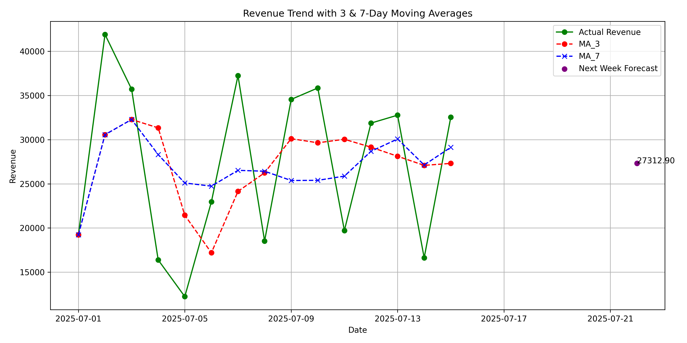

# 📊 Sales Trend Analysis & Forecasting

This project performs time series analysis and forecasting of sales revenue using **moving averages** (3-day and 7-day windows). It also generates a clear line plot showing actual revenue and trendlines, then exports the full analysis and chart into an Excel file with image embedding.

---

## 🧩 Features

- Clean and process raw sales data
- Calculate daily total revenue
- Apply moving average (MA-3 and MA-7) for trend analysis
- Forecast revenue for the next week
- Generate and save plot with Matplotlib
- Export full report to Excel with embedded plot

---

## 📷 Visualization Preview



---

## 📁 Output Files

- `Revenue_Trend_Analysis.xlsx`  
  → Excel file containing cleaned data, computed moving averages, and the embedded chart.

- `Revenue_Forecast.png`  
  → Saved plot image of the trend with forecast point.

---

## 🚀 How to Run

```bash
pip install pandas matplotlib openpyxl
python sales_forecast.py


## 📄 License

This project is licensed under the MIT License. See the  file for more details.


